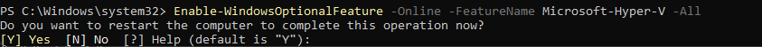

# Documentation

## Modules
Liste des modules utilisés dans ce projet.

## Description

- **AD-TO-PSQL** : L'objectif du module AD-TO-PSQL est de faciliter la maintenance des permissions d'une base de données en copiant les groupes de l'active directory dans la base de données. Cette fonction est fait pour gérer les permissions de lecture, écriture, création et suppression pour les utilisateur du logiciel. Parfois les applications peuvent utiliser les permissions de l'active directory , mais cette librairie est faites pour donner les permissions mêmes la base de donnée pour éviter les oublies dans le logiciel. 

install .net 

Installer le developper package 
https://dotnet.microsoft.com/en-us/download/dotnet-framework/net481


Invoke-WebRequest -Uri https://dot.net/v1/dotnet-install.ps1 -OutFile dotnet-install.ps1
powershell -ExecutionPolicy Bypass -File ./dotnet-install.ps1 -Channel 8.0

mettre environnement variable
C:\Users\Administrator\AppData\Local\Microsoft\dotnet

mkdir "C:\Program Files\npgsql"

dotnet new console -n MyNpgsqlProject

cd "C:\Program Files\npgsql\MyNpgsqlProject"

dotnet add package Npgsql

dotnet build


%UserProfile%\.nuget\packages\npgsql\8.0.5\lib\net8.0


il faut avoir abstraction pour que ca roule

C:\Users\Administrator\.nuget\packages\microsoft.extensions.logging.abstractions\8.0.0\microsoft.extensions.logging.abstractions.8.0.0\lib\net8.0


## Commandes de création

### Hyper-v
Installtion du module hyper-v. Le redémarrage est automatique.
```
Enable-WindowsOptionalFeature -Online -FeatureName Microsoft-Hyper-V -All 
```
Tapez "Y" dans le terminal pour redémarrer la votre machine  




## Installation

# Set TLS 1.2 to ensure secure connections
[Net.ServicePointManager]::SecurityProtocol = [Net.SecurityProtocolType]::Tls12

# Register the PSGallery repository if it's not already registered
Register-PSRepository -Default

# Install the CredentialManager module
Install-Module -Name CredentialManager -Scope CurrentUser -Force

Get-WindowsCapability -Name RSAT.ActiveDirectory* -Online | Add-WindowsCapability -Online

Get-Module -ListAvailable -Name ActiveDirectory


 Install-Module -Name CredentialManager -Scope CurrentUser


Register-PSRepository -Default

Set-ExecutionPolicy -ExecutionPolicy RemoteSigned -Scope CurrentUser

 a voir : Install-Package -Name Npgsql -Source https://www.nuget.org/api/v2

Install-Module -Name CredentialManager -Scope CurrentUser  choisir A(all)


## Commandes
Les commandes PowerShell suivantes sont utilisées dans le script :

```powershell
# Commande pour lister les fichiers dans un répertoire

Get-Module -ListAvailable

```
Install-Package Npgsql
Type Y
```
Tapez A pour tout installer


installer nuget 

https://www.nuget.org/downloads
```
https://www.postgresql.org/
```

Invoke-WebRequest -Uri "https://the.earth.li/~sgtatham/putty/latest/w64/putty-64bit-installer.msi" -OutFile "$env:TEMP\putty-installer.msi"
```
```
Start-Process msiexec.exe -ArgumentList "/i $env:TEMP\putty-installer.msi /quiet" -Wait
```


## Références

Manifest 
___
* https://learn.microsoft.com/en-us/powershell/module/microsoft.powershell.core/new-modulemanifest?view=powershell-7.4

Secure string
___
* https://learn.microsoft.com/en-us/powershell/module/microsoft.powershell.security/convertto-securestring?view=powershell-7.4


### Commandes utiles (personnel pour travailler)

 New-ModuleManifest -Path ./AD_TO_PSQL.psd1 `
